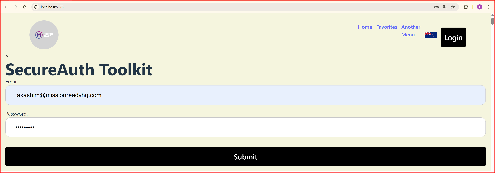
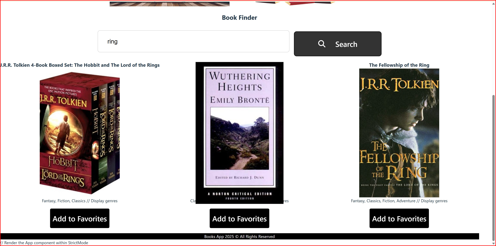
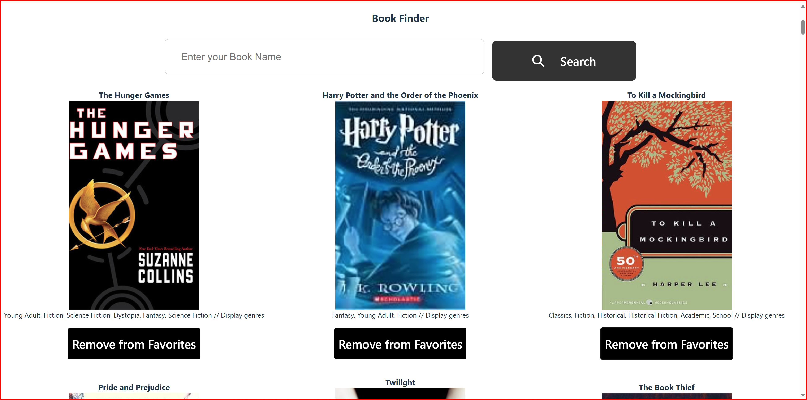
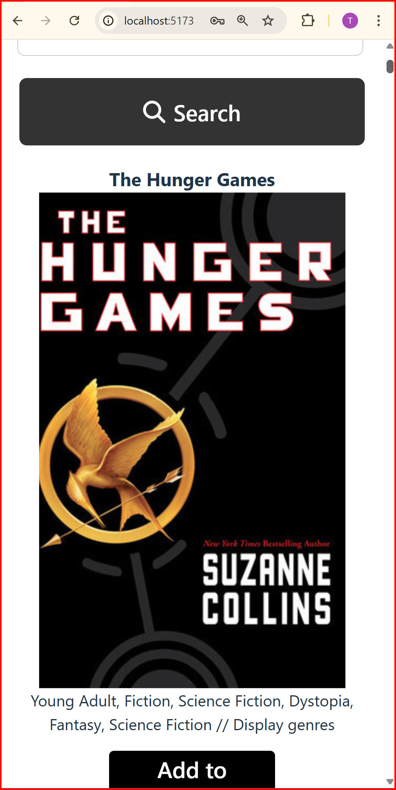

# Amazing Books Application

## About The Project

This project is a book search and management application built with React. Users can search for books, view details, and manage their favorite books.

### Key Features:
- User registration and authentication
- Advanced book search functionality
- Detailed book information and reviews
- Favorites and reading list management
- Responsive design for mobile and desktop users
- Dark mode for enhanced user experience
- **RESTful API** for backend communication, providing a structured way to interact with the database.

## Technologies

- **React**: A library for building user interfaces
- **Vite**: A fast front-end build tool
- **React Router**: Client-side routing
- **Axios**: HTTP request library
- **Font Awesome**: Icon library
- **Express.js**: (for building the RESTful API)
- **CSS and Bootstrap**: (for styling)

This project is an excellent opportunity to learn and implement modern web development practices, focusing on creating a scalable and maintainable application. Whether you're a book enthusiast or a developer looking to enhance your skills, this application offers a valuable experience.

## Getting Started

This is an example of how you may give instructions on setting up your project locally. To get a local copy up and running, follow these simple steps.


## Installation

1. Clone the repository:

   ```bash
   git clone <repository-url>
   ```

2. Navigate to the project directory:

   ```bash
   cd Build Amazing Books Application
   ```

3. Install the dependencies:

   ```bash
   npm install
   ```

4. Install React Router:

   ```bash
   npm install react-router-dom
   ```

5. Start the application::

   ```bash
   npm run dev
   ```

## Features

This application includes the following features:

- **User Registration**:
  - Users can create an account easily with just an email and password.
  - Email verification to confirm the user's identity.

- **User Login**:
  - Registered users can log in using their email and password.
  - Option for social media login (e.g., Google, Facebook).

- **Book Search**:
  - Users can search for books by title, author, or ISBN.
  - Live search results update as the user types.

- **Book Details**:
  - Detailed view of each book, including:
    - Author
    - Publication year
    - Genre
    - Ratings and reviews
    - Synopsis

- **Favorites Feature**:
  - Users can add books to their favorites list for easy access later.
  - Ability to remove books from the favorites list.

- **Recommendations**:
  - Personalized book recommendations based on user preferences and reading history.
  - Trending books section to showcase popular titles.

- **Responsive Design**:
  - Fully responsive layout for optimal viewing on mobile devices and tablets.

- **Dark Mode**:
  - Toggle between light and dark themes for user comfort.

- **User Profile**:
  - Users can manage their profile settings, including updating personal information and changing passwords.

- **Notifications**:
  - Users receive notifications for new book releases, reviews, and other updates.

- **Admin Dashboard** (if applicable):
  - Admin users can manage book entries, user accounts, and reviews.
  - Analytics to track user engagement and popular books.

- **Offline Access**:
  - Cached data for offline access to previously viewed books and information.

- **Bookmarking**:
  - Users can bookmark specific pages or sections of books for quick reference.

- **Multi-language Support**:
  - Support for multiple languages to cater to a diverse user base.

## Screenshots

Add 5 screenshots (examples) here to illustrate the application’s features:

## Screenshots

- **Screenshot 1: User Registration Screen**  
  

- **Screenshot 2: Book Search Results**  
  

- **Screenshot 3: Favorites List**  
  

- **Screenshot 4: Book responsiveness in mobile size Page**  
  

- **Screenshot 5: Book modal mobil Page**  
  


## Scripts

The following scripts are available in this project:

- **dev**: Starts the development server.
- **build**: Builds the application for production.
- **lint**: Runs static analysis on the code.
- **preview**: Displays a preview of the built application.

## Environment Variables

- **VITE_BACKEND_URL**: Set the URL for the backend API. The default is `http://localhost:5000`.

## HTML Template

Here is the basic structure of the `public/index.html` file, which serves as the entry point for the application:

```html
<!DOCTYPE html>
<html lang="en">
  <head>
    <meta charset="UTF-8" />
    <link rel="icon" href="%PUBLIC_URL%/favicon.ico" />
    <meta name="viewport" content="width=device-width, initial-scale=1.0" />
    <meta name="theme-color" content="#000000" />
    <meta
      name="description"
      content="Web site created using create-react-app"
    />
    <link rel="apple-touch-icon" href="%PUBLIC_URL%/logo192.png" />
    <link rel="manifest" href="%PUBLIC_URL%/manifest.json" />
    <title>React App</title>
    <link
      rel="stylesheet"
      href="https://use.fontawesome.com/releases/v5.15.4/css/all.css"
      integrity="sha384-DyZ88mC6Up2uqS4h/KRgHuoeGwBcD4Ng9SiP4dIRy0EXTlnuz47vAwmeGwVChigm"
      crossorigin="anonymous"
    />
  </head>
  <body>
    <noscript>You need to enable JavaScript to run this app.</noscript>
    <div id="root"></div>
  </body>
</html>
```

## Environment Variables

For this project, you will need to create a `.env` file in the root directory. This file should contain the following environment variables:


Make sure to replace the URL with your backend API URL if it's different.

## .gitignore

To ensure that sensitive information and unnecessary files are not tracked by Git, include the following entries in your `.gitignore` file:


## Notes

- To run this application, a backend API is required. Please ensure that a properly configured backend server is running.


